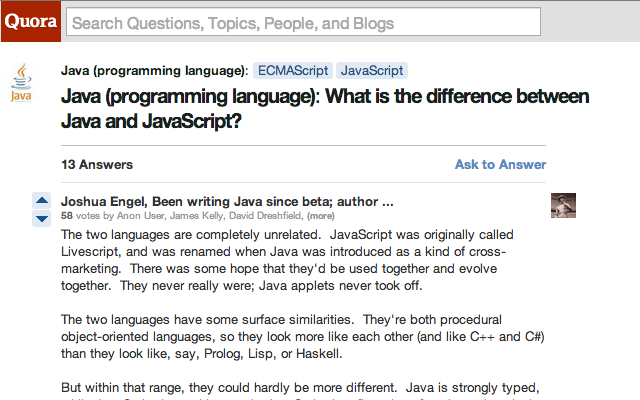

#  Quora Unblocker

> Chrome extension - Removes the login requirement and any nagging about it

[][install]

Quora has a quite obscure way to view content [without logging in](http://blog.quora.com/Making-Sharing-Better) by appending `?share=1` to the url. This extensions appends that to every Quora url you visit in addition to removing some annoying login nags.

## Install

[Get it on the Chrome Web Store.][install]

## Related

Not using Chrome? Check out the equivalent [userscript](https://github.com/sindresorhus/quora-unblocker-userscript).

## License

MIT © [Sindre Sorhus](http://sindresorhus.com)

[install]: https://chrome.google.com/webstore/detail/quora-unblocker/pcjnlebeogfamlbeloiccdidgmaeojhe
